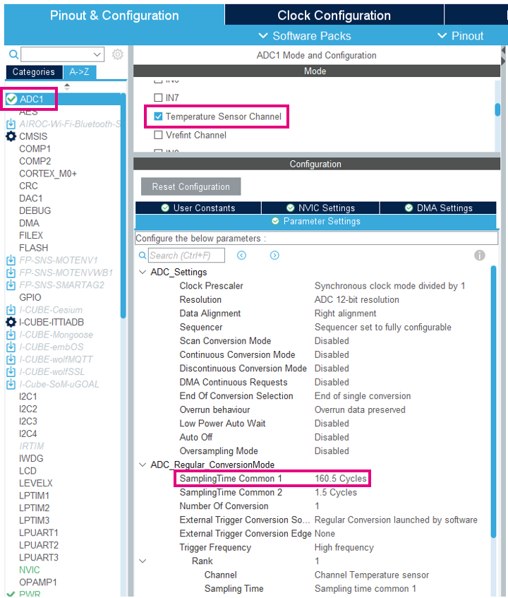

# CubeMX Configuration

1. Select ADC1
2. Select temperature sensor

In Configuration

3. Set `Sampling Time Common 1` to **160.5 cycles**



4. Generate code
5. 
### **Internal inputs**

The ADC input is connected to internal peripheries of STM32U0.
Typically some internal referential voltages can be read or temperature sensor.


# ADC resolution

The ADC can be set to different resolution.

## ADC1

Resolution up to 12bit.
It is possible to perform faster conversion by reducing the ADC resolution.

| Resolution | Conversion periods (ADC Clock cycles) |
|------------|--------------------|
| 12 bit     | 12.5 ADC CLK       |
| 10 bit     | 10.5 ADC CLK       |
| 8 bit      | 18.5 ADC CLK       |
| 6 bit      | 6.5 ADC CLK        |


# ADC (regular) conversion modes

In this part we will focus on two options:

- CONT mode (continuous)
- DISCEN mode (discontinuous)

## Single conversion

# CubeIDE Application Code

## Measure ADC value

1. Add variable for ADC data in *USER CODE PV* section. We will read the value from ADC and stock it in this variable.

```c
volatile uint16_t value;
```

2. Calibrate ADC, start ADC and read data

Write the following code in the *USER CODE WHILE* section:

```c
  HAL_ADCEx_Calibration_Start(&hadc1);
  HAL_ADC_Start(&hadc1);
  HAL_ADC_PollForConversion(&hadc1, 0xFFFFFFFF);
  value = HAL_ADC_GetValue(&hadc1);
```

3. Compile and debug the code
4. Add value to `Live variables`
5. Try to head the device


## Convert ADC data to real temperature

1. Add temperature variable to *USER CODE PV* section:

```c
volatile int32_t temperature;
```

2. Add a conversion after ADC reading in the *USER CODE WHILE* section:

```c
  temperature =__HAL_ADC_CALC_TEMPERATURE(3300, value, ADC_RESOLUTION_12B);
```

3. Now we can add the `temperature` variable to live watch
