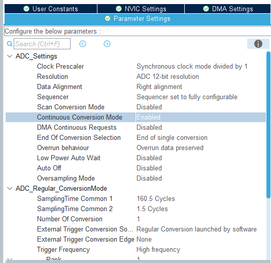
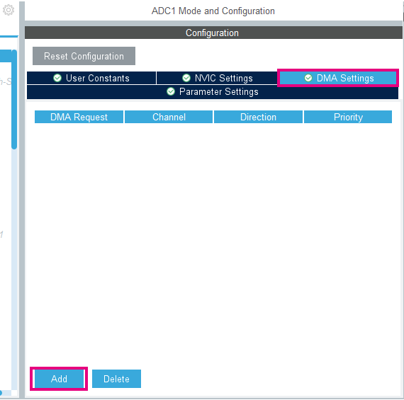
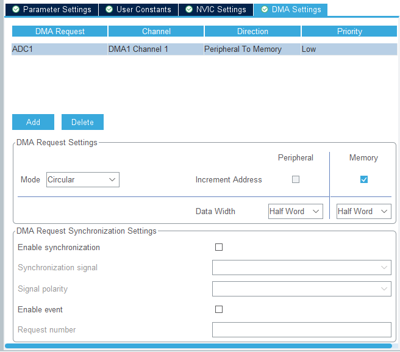
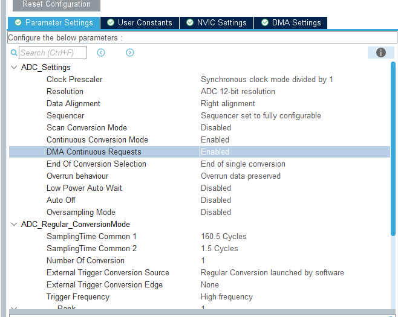

----!
Presentation
----!
# Continuous scan mode and DMA - CubeMX Configuration

Now we will use DMA to read data from ADC. So the core will not need to handle it.

1. In ADC1 config, select:
  - `Temperature Sensor Channel`
  - `Vrefint channel`
  - `Vbat channel`


2. Set `continuous conversion mode` to **ENABLE**



3. Open DMA settings Click on `ADD` and select ADC1.



The minimum settings as the legacy STM32 will be

- Circular mode
- Request
- Priority
- Direction
- Source address increment after transfer
- Source Data width
- Destination address increment after transfer
- Destination Data width

Configure the DMA as shown just bellow:



4. Go back in *Parameter Settings* and set `DMA Continuous Requests` to **ENABLE**



5. Generate code

# Continuous scan mode and DMA - CubeIDE Application Code

1. Add adc buffer for DMA

```c
/* USER CODE BEGIN PV */
volatile uint16_t value;
volatile int32_t temperature;
volatile uint16_t vbat;
volatile uint16_t vrefint;

uint16_t adc_buffer[6];
/* USER CODE END PV */
```

2. Start the DMA and ADC

```c
  /* USER CODE BEGIN 2 */
  HAL_ADC_Start_DMA(&hadc1, adc_buffer, 6);
  /* USER CODE END 2 */
```

3. Remove poll reading from while loop

```c
  /* USER CODE BEGIN WHILE */
  while (1)
  {
	  temperature =__HAL_ADC_CALC_TEMPERATURE(hadc1.instance,3300,adc_buffer[0],ADC_RESOLUTION_14B);
    /* USER CODE END WHILE */
```
