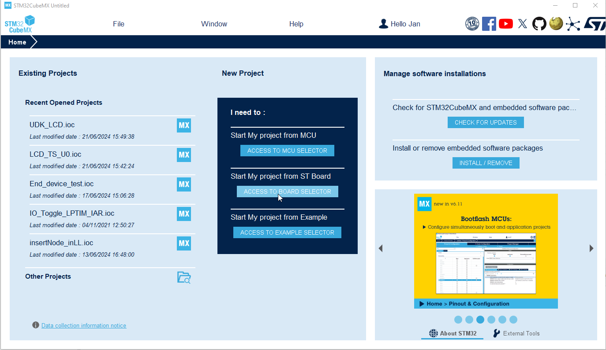
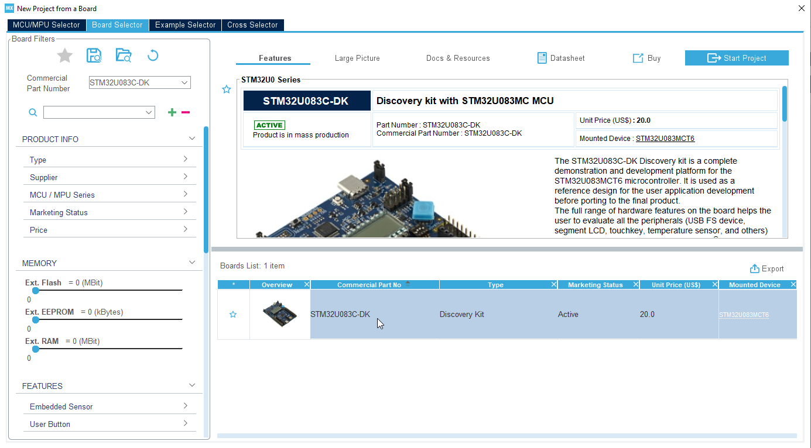
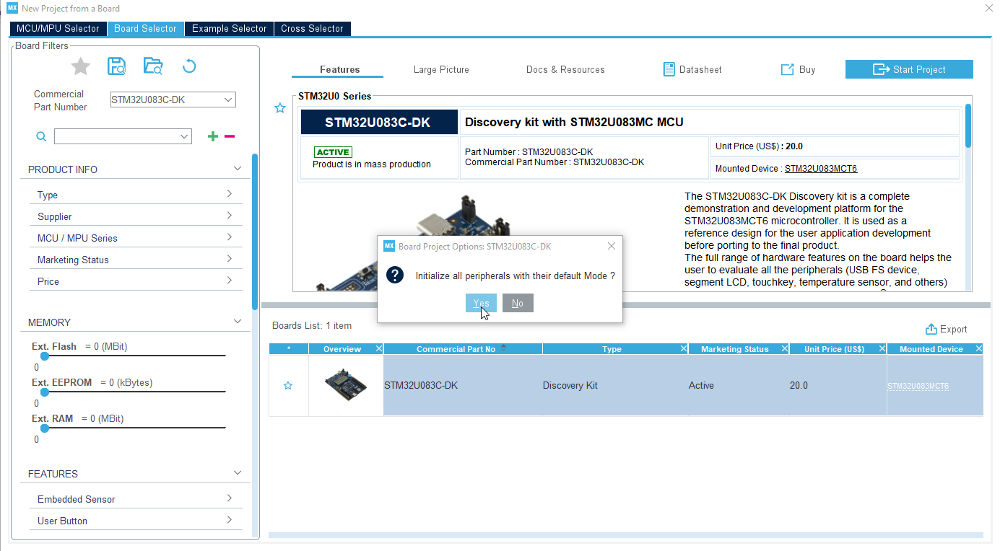

----!
Presentation
----!

# Open CubeMx or CubeMX plugin in CubeIDE
Press **Access to BOARD selector**

 

# Select STM320U83C-DK and Start Project

 

# Initialize all peripherals
- click **YES**

 

