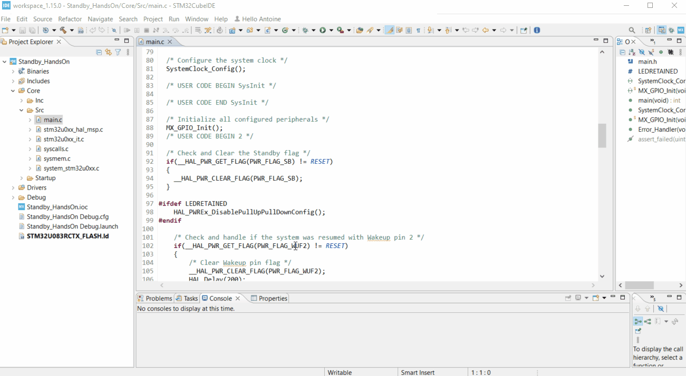

----!
Presentation
----!
# Application code
## #define Led Retention
Add the following code in the `Private define` section:

>```c
/* Private define ------------------------------------------------------------*/
>/* USER CODE BEGIN PD */
>
>/* USER CODE END PD */```

```c
#define LEDRETAINED
```

## User Code
Here are the different steps of the application:

- Check if the system was in Standby and then Clear the Standby flag
- Check if the system was resumed with Wakeup pin 2 and then clear it. In this case, the LED4 will blink
- if *LEDRETAINED* is defined, configure the pullup retention
- Enable ultra low power mode
- Enable WakeUp Pin PWR_WAKEUP_PIN2 connected to PC.13
- Enter in Standby mode

Add the following code in the `USER CODE 2` section:

>/* USER CODE BEGIN 2 */
>
>/* USER CODE END 2 */


```c
/* Check and Clear the Standby flag */
if(__HAL_PWR_GET_FLAG(PWR_FLAG_SB) != RESET)
{
__HAL_PWR_CLEAR_FLAG(PWR_FLAG_SB);
}

#ifdef LEDRETAINED
HAL_PWREx_DisablePullUpPullDownConfig();
#endif

/* Check and handle if the system was resumed with Wakeup pin 2 */
if(__HAL_PWR_GET_FLAG(PWR_FLAG_WUF2) != RESET)
{
  /* Clear Wakeup pin flag */
  __HAL_PWR_CLEAR_FLAG(PWR_FLAG_WUF2);
  HAL_Delay(200);
  HAL_GPIO_TogglePin(GPIOA, GPIO_PIN_5);
  HAL_Delay(200);
  HAL_GPIO_TogglePin(GPIOA, GPIO_PIN_5);
  HAL_Delay(200);
  HAL_GPIO_TogglePin(GPIOA, GPIO_PIN_5);
  HAL_Delay(200);
  HAL_GPIO_TogglePin(GPIOA, GPIO_PIN_5);
  HAL_Delay(200);
}

/* Enable ultra low power mode */
HAL_PWREx_EnableUltraLowPowerMode();

#ifdef LEDRETAINED
HAL_PWREx_EnableGPIOPullUp(PWR_GPIO_A, PWR_GPIO_BIT_5);
HAL_PWREx_EnablePullUpPullDownConfig();
#endif

/* Enable WakeUp Pin PWR_WAKEUP_PIN2 connected to PC.13 */
HAL_PWREx_EnableGPIOPullUp(PWR_GPIO_C, PWR_GPIO_BIT_13);
HAL_PWREx_EnablePullUpPullDownConfig();
HAL_PWR_EnableWakeUpPin(PWR_WAKEUP_PIN2_LOW);

/* Enter the system to STANDBY mode */
HAL_PWR_EnterSTANDBYMode();
```

# Run the application
Now it is time to build and run the application on the NUCLEO-U083RC.\
Build the project by clicking on the *hammer* icon : \
Then, Run the application on the NUCLEO-U083RC by clicking on the *play* icon : 


