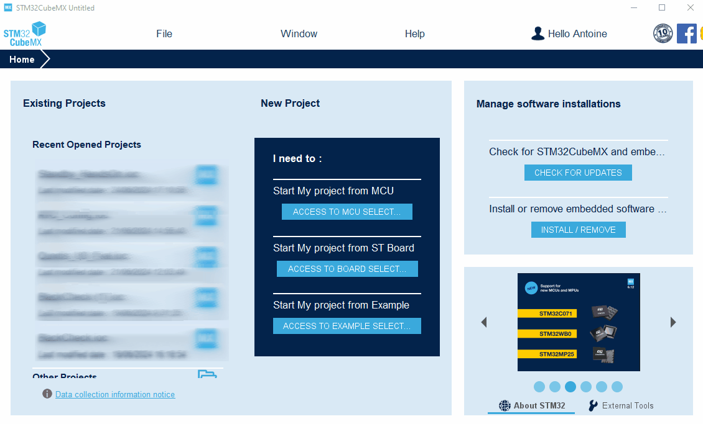
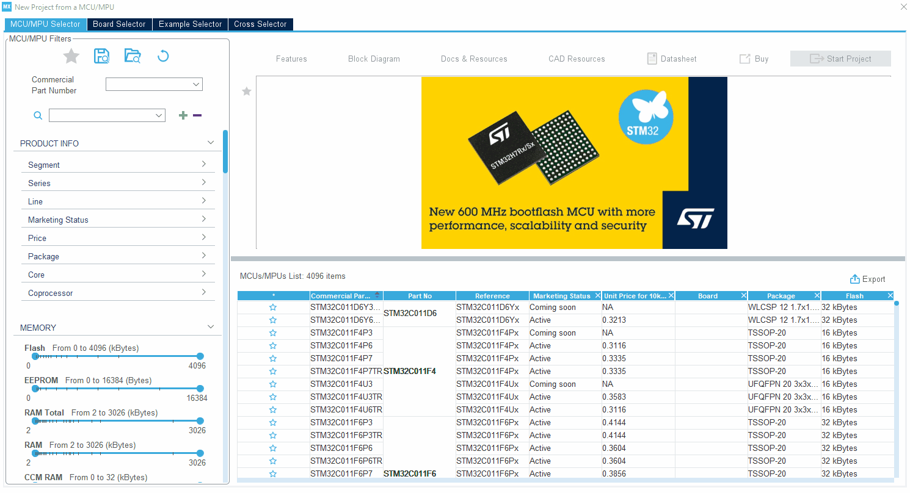
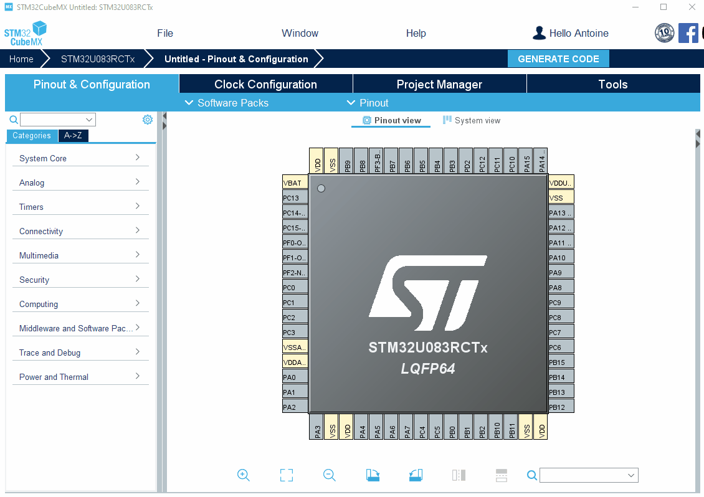
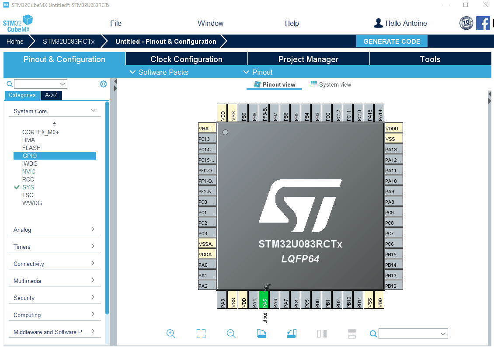
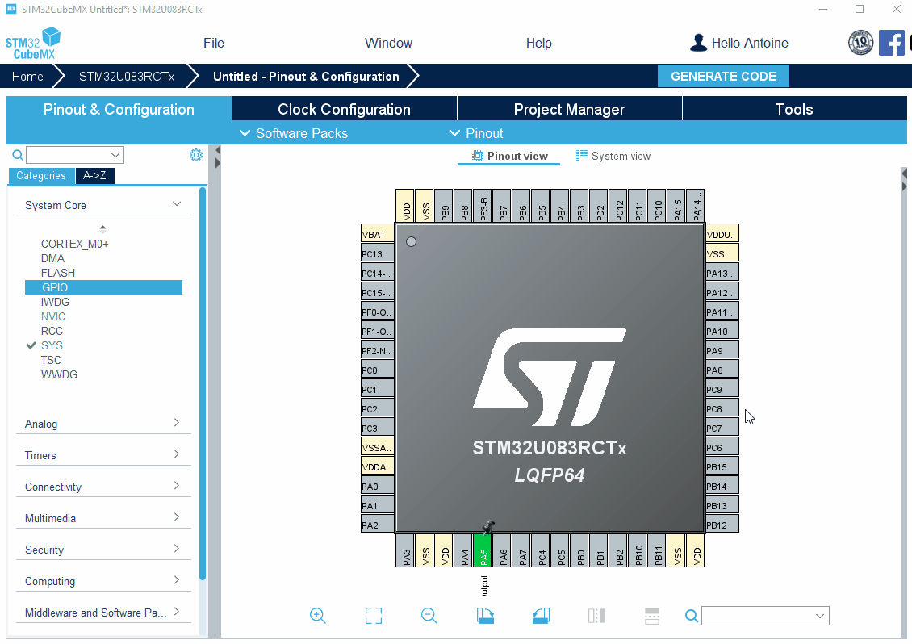

----!
Presentation
----!
# Standby Hands On - PullUp Retention
# Introduction
For this hands on, we will see how to set up pullup/pulldown retention in Standby mode. For this exercise, we will use the NUCLEO-U083RC. Here are the steps we are going to do in this hands on:
- Enter in Standby​
- How to handle exit from Standby ​
- Monitor activity on LED​
- Keep PU/PD retention during Standby mode​
- Play with CubeMonitorPWR and PWRShiled and V3PWR

For this session, we will need following materials.\
Hardware:
- **NUCLEO-U083RC**
- **STLINK-V3PWR**

Software:
- **STM32CubeMX**
- **STM32CubeIDE**
- **STM32CubeMonPWR**

## STM32CubeMX project
In CubeMX, start a new project by selecting the right MCU. In this example, we will use the STM32U083RCT6 embedded on the NUCLEO-U083RC.




Configure PC7 as Output Push-Pull. Right click on PC7 and set as GPIO_Output\
Change default Output to High (LED On)\




[/* USER CODE BEGIN 2 */](#code)\
\
[/* USER CODE END 2 */](#code)

```c
/* Check and Clear the Standby flag */
if(__HAL_PWR_GET_FLAG(PWR_FLAG_SB) != RESET)
{
__HAL_PWR_CLEAR_FLAG(PWR_FLAG_SB);
}

#ifdef LEDRETAINED
HAL_PWREx_DisablePullUpPullDownConfig();
#endif

/* Check and handle if the system was resumed with Wakeup pin 2 */
if(__HAL_PWR_GET_FLAG(PWR_FLAG_WUF2) != RESET)
{
  /* Clear Wakeup pin flag */
  __HAL_PWR_CLEAR_FLAG(PWR_FLAG_WUF2);
  HAL_Delay(200);
  HAL_GPIO_TogglePin(GPIOA, GPIO_PIN_5);
  HAL_Delay(200);
  HAL_GPIO_TogglePin(GPIOA, GPIO_PIN_5);
  HAL_Delay(200);
  HAL_GPIO_TogglePin(GPIOA, GPIO_PIN_5);
  HAL_Delay(200);
  HAL_GPIO_TogglePin(GPIOA, GPIO_PIN_5);
  HAL_Delay(200);
}

/* Enable ultra low power mode */
HAL_PWREx_EnableUltraLowPowerMode();

#ifdef LEDRETAINED
HAL_PWREx_EnableGPIOPullUp(PWR_GPIO_A, PWR_GPIO_BIT_5);
HAL_PWREx_EnablePullUpPullDownConfig();
#endif

/* Enable WakeUp Pin PWR_WAKEUP_PIN2 connected to PC.13 */
HAL_PWREx_EnableGPIOPullUp(PWR_GPIO_C, PWR_GPIO_BIT_13);
HAL_PWREx_EnablePullUpPullDownConfig();
HAL_PWR_EnableWakeUpPin(PWR_WAKEUP_PIN2_LOW);

/* Enter the system to STANDBY mode */
HAL_PWR_EnterSTANDBYMode();
```
```c
#define LEDRETAINED
```
\
\


----!Presentation----!


https://www.markdownguide.org/basic-syntax/
[link](www.st.com)
